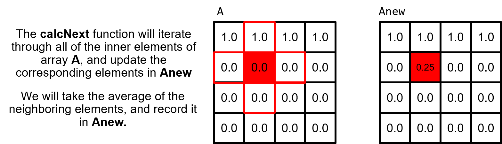

# 2D Heat Plate Simulation on GPU

This project implements a GPU-accelerated simulation of heat distribution on a 2D metal plate using the Jacobi iterative method.

The serial implementation is based on the [OpenACC Training Materials](https://github.com/OpenACC/openacc-training-materials) provided by OpenACC.org  
This repository extends the original tutorial by adding a CUDA version for GPU acceleration.

## Descripition

### Code Description

The code simulates heat distribution across a 2-dimensional metal plate. In the beginning, the plate will be unheated, meaning that the entire plate will be room temperature. A constant heat will be applied to the edge of the plate and the code will simulate that heat distributing across the plate over time.  

This is a visual representation of the plate before the simulation starts:  
  
  
  
We can see that the plate is uniformly room temperature, except for the top edge. Within the [laplace2d.c](./Serial/laplace2d.c) file, we see a function called **`initialize`**. This function is what "heats" the top edge of the plate. 
  
```
void initialize(double *restrict A, double *restrict Anew, int m, int n)  
{  
    memset(A, 0, n * m * sizeof(double));  
    memset(Anew, 0, n * m * sizeof(double));  
  
    for(int i = 0; i < m; i++){  
        A[i] = 1.0;  
        Anew[i] = 1.0;  
    }  
}  
```

After the top edge is heated, the code will simulate the heat distributing across the length of the plate. We will keep the top edge at a constant heat as the simulation progresses.

This is the plate after several iterations of our simulation:  
  
 

That's the theory: simple heat distribution. However, we are more interested in how the code works. 

### Code Breakdown

The 2-dimensional plate is represented by a 2-dimensional array containing double-precision floating point values. These doubles represent temperature; 0.0 is room temperature, and 1.0 is our max temperature. The 2-dimensional plate has two states, one represents the current temperature, and one represents the expected temperature values at the next step in our simulation. These two states are represented by arrays **`A`** and **`Anew`** respectively. The following is a visual representation of these arrays, with the top edge "heated".

  
    
Simulating this state in two arrays is very important for our **`calcNext`** function. Our calcNext is essentially our "simulate" function. calcNext will look at the inner elements of A (meaning everything except for the edges of the plate) and update each elements temperature based on the temperature of its neighbors.  If we attempted to calculate in-place (using only **`A`**), then each element would calculate its new temperature based on the updated temperature of previous elements. This data dependency not only prevents parallelizing the code, but would also result in incorrect results when run in serial. By calculating into the temporary array **`Anew`** we ensure that an entire step of our simulation has completed before updating the **`A`** array.

  

Below is the **`calcNext`** function:
```
01 double calcNext(double *restrict A, double *restrict Anew, int m, int n)
02 {
03     double error = 0.0;  
04     for( int j = 1; j < n-1; j++)  
05     {  
06        for( int i = 1; i < m-1; i++ )   
07        {  
08            Anew[OFFSET(j, i, m)] = 0.25 * ( A[OFFSET(j, i+1, m)] + A[OFFSET(j, i-1, m)]  
09                                           + A[OFFSET(j-1, i, m)] + A[OFFSET(j+1, i, m)]);  
10            error = fmax( error, fabs(Anew[OFFSET(j, i, m)] - A[OFFSET(j, i , m)]));  
11        }  
12    }  
13    return error;  
14 }  
```

We see on lines 07 and 08 where we are calculating the value of **`Anew`** at **`i,j`** by averaging the current values of its neighbors. Line 09 is where we calculate the current rate of change for the simulation by looking at how much the **`i,j`** element changed during this step and finding the maximum value for this **`error`**. This allows us to short-circuit our simulation if it reaches a steady state before we've completed our maximum number of iterations.

Lastly, our **`swap`** function will copy the contents of **`Anew`** to **`A`**.

```
01 void swap(double *restrict A, double *restrict Anew, int m, int n)
02 {	
03    for( int j = 1; j < n-1; j++)
04    {
05        for( int i = 1; i < m-1; i++ )
06        {
07            A[OFFSET(j, i, m)] = Anew[OFFSET(j, i, m)];    
08        }
09    }
10 }
```

---
